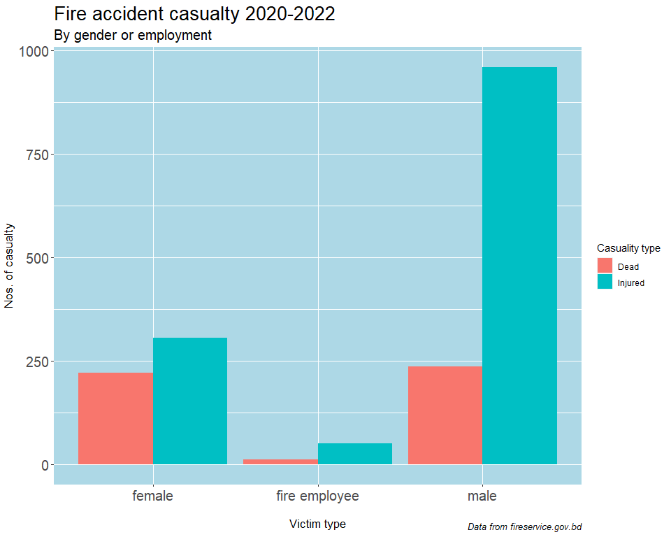

An analysis of casualties in fire accidents in Bangladesh 2020-2022
================
Md. Sourav Hasan Rabby
May 23, 2023

-   <a href="#introduction" id="toc-introduction">Introduction</a>
-   <a href="#why-choosing-2020-2022-timeline"
    id="toc-why-choosing-2020-2022-timeline">Why choosing 2020-2022
    timeline?</a>
-   <a href="#desclaimer" id="toc-desclaimer">Desclaimer</a>
-   <a href="#analysis" id="toc-analysis">Analysis</a>
    -   <a href="#importing-libraries" id="toc-importing-libraries">Importing
        libraries</a>
    -   <a href="#importing-raw-data" id="toc-importing-raw-data">Importing raw
        data</a>
    -   <a href="#data-cleaning-and-modification"
        id="toc-data-cleaning-and-modification">Data cleaning and
        modification</a>
    -   <a href="#yearly-casualty" id="toc-yearly-casualty">Yearly casualty</a>
    -   <a href="#casualty-by-victim-type"
        id="toc-casualty-by-victim-type">Casualty by victim type</a>
    -   <a href="#casualty-by-type-per-year"
        id="toc-casualty-by-type-per-year">Casualty by type per year</a>
    -   <a href="#casualty-by-fire-accident-scene"
        id="toc-casualty-by-fire-accident-scene">Casualty by fire accident
        scene</a>
    -   <a href="#fatality-by-victim-type-and-fire-accident-scene"
        id="toc-fatality-by-victim-type-and-fire-accident-scene">Fatality by
        victim type and fire accident scene</a>
    -   <a
        href="#comparison-of-number-of-fire-accidents-with-number-of-casualties"
        id="toc-comparison-of-number-of-fire-accidents-with-number-of-casualties">Comparison
        of number of fire accidents with number of casualties</a>

## Introduction

This is a simple analysis of casualties occurred in a number of fire
accidents in Bangladesh in between year 2020 and 2022. The data has been
taken from Bangladesh Fire Service [website](fireservice.gov.bd). This
notebook also explains how the analysis was done.

## Why choosing 2020-2022 timeline?

Though in the [website](fireservice.gov.bd) of ***Bangladesh Fire
Service*** there have been data from 2015 to 2022, the format of the
documents from 2015-2019 is structurally different from those of
2020-2022. As a result they can’t be merged or can be merged after lots
of modification. We have a plan to make a separate analysis for
2015-2019 timeline.

## Desclaimer

This analysis is a personal project and no in any way suggests or claims
anything.

## Analysis

#### Importing libraries

We at first import necessary libraries for analysis.

``` r
library(tidyverse) # for data cleaning, wrangling and vizualization.
```

    ## ── Attaching core tidyverse packages ──────────────────────── tidyverse 2.0.0 ──
    ## ✔ dplyr     1.1.0     ✔ readr     2.1.4
    ## ✔ forcats   1.0.0     ✔ stringr   1.5.0
    ## ✔ ggplot2   3.4.1     ✔ tibble    3.1.8
    ## ✔ lubridate 1.9.2     ✔ tidyr     1.3.0
    ## ✔ purrr     1.0.1     
    ## ── Conflicts ────────────────────────────────────────── tidyverse_conflicts() ──
    ## ✖ dplyr::filter() masks stats::filter()
    ## ✖ dplyr::lag()    masks stats::lag()
    ## ℹ Use the ]8;;http://conflicted.r-lib.org/conflicted package]8;; to force all conflicts to become errors

``` r
library(treemapify) # for treemap graphical vizualization.
```

    ## Warning: package 'treemapify' was built under R version 4.2.3

#### Importing raw data

Now let import raw dataset. You can get the raw data
[here](https://drive.google.com/drive/folders/1QzjEYWuTmctMSHcBCbo1vGdkep0gb7qV).
We also look at the head of the dataset and get the column names of the
dataset.

``` r
data <- read.csv("E:/Fire Data analysis/Data/Fire injury death 2020-2022.csv")
head(data)
```

    ##   year Description.of.fire.accident.scene common_people_injured_male
    ## 1 2022              factory-industry fire                         35
    ## 2 2022                          slum fire                         21
    ## 3 2022     gas distribution pipeline fire                         14
    ## 4 2022                  gas cylinder fire                         28
    ## 5 2022                        boiler fire                          5
    ## 6 2022        multi-storied building fire                          9
    ##   common_people_injured_female total_common_injured common_people_dead_male
    ## 1                            5                   40                      47
    ## 2                            8                   29                       2
    ## 3                            7                   21                       7
    ## 4                            2                   30                       0
    ## 5                            1                    6                       0
    ## 6                            9                   18                       4
    ##   common_people_dead_female total_common_dead injured_fire_employee
    ## 1                         3                50                    17
    ## 2                         4                 6                     0
    ## 3                         0                 7                     0
    ## 4                         1                 1                     0
    ## 5                         0                 0                     0
    ## 6                         2                 6                     4
    ##   dead_fire_employee injured_rescued_male injured_rescued_female
    ## 1                 13                   35                      5
    ## 2                  0                   21                      8
    ## 3                  0                   14                      7
    ## 4                  0                   28                      2
    ## 5                  0                    5                      1
    ## 6                  0                    9                      9
    ##   total_injued_rescued dead_rescued_male dead_rescued_female total_dead_rescued
    ## 1                   40                47                   3                 50
    ## 2                   29                 2                   4                  6
    ## 3                   21                 7                   0                  7
    ## 4                   30                 0                   1                  1
    ## 5                    6                 0                   0                  0
    ## 6                   18                 4                   2                  6

``` r
colnames(data)
```

    ##  [1] "year"                               "Description.of.fire.accident.scene"
    ##  [3] "common_people_injured_male"         "common_people_injured_female"      
    ##  [5] "total_common_injured"               "common_people_dead_male"           
    ##  [7] "common_people_dead_female"          "total_common_dead"                 
    ##  [9] "injured_fire_employee"              "dead_fire_employee"                
    ## [11] "injured_rescued_male"               "injured_rescued_female"            
    ## [13] "total_injued_rescued"               "dead_rescued_male"                 
    ## [15] "dead_rescued_female"                "total_dead_rescued"

#### Data cleaning and modification

We don’t need the columns which deals with ‘total’ of other columns (for
example: total_common_injured column can be obtained from the summation
of two prior columns.). Also we won’t deal with the ‘rescue’ columns. So
we will scrap those columns.

There is a row named **total** which shows the summation of each column
which we don’t need since we can compute those easily. So we will delete
this row too.

``` r
# Removing specific columns having total and rescued data
data2 <- data |> select(1, 2, 3, 4, 6, 7, 9, 10)
data2 <- data2[-40,] # Removing 'total' row
```

Let us look at the dataset now. We will look at the column names too.

``` r
head(data2)
```

    ##   year Description.of.fire.accident.scene common_people_injured_male
    ## 1 2022              factory-industry fire                         35
    ## 2 2022                          slum fire                         21
    ## 3 2022     gas distribution pipeline fire                         14
    ## 4 2022                  gas cylinder fire                         28
    ## 5 2022                        boiler fire                          5
    ## 6 2022        multi-storied building fire                          9
    ##   common_people_injured_female common_people_dead_male
    ## 1                            5                      47
    ## 2                            8                       2
    ## 3                            7                       7
    ## 4                            2                       0
    ## 5                            1                       0
    ## 6                            9                       4
    ##   common_people_dead_female injured_fire_employee dead_fire_employee
    ## 1                         3                    17                 13
    ## 2                         4                     0                  0
    ## 3                         0                     0                  0
    ## 4                         1                     0                  0
    ## 5                         0                     0                  0
    ## 6                         2                     4                  0

``` r
colnames(data2)
```

    ## [1] "year"                               "Description.of.fire.accident.scene"
    ## [3] "common_people_injured_male"         "common_people_injured_female"      
    ## [5] "common_people_dead_male"            "common_people_dead_female"         
    ## [7] "injured_fire_employee"              "dead_fire_employee"

We will now rename the columns which begins with *‘common_poeple\_’* to
give those columns with shorter names. We also will rename the column
with term *‘fire_employee’* to **fire employee**.

``` r
colnames(data2) <- gsub('common_people_', '', colnames(data2))
colnames(data2) <- gsub('fire_employee', 'fire employee', colnames(data2))
```

Let us check the column names now:

``` r
colnames(data2)
```

    ## [1] "year"                               "Description.of.fire.accident.scene"
    ## [3] "injured_male"                       "injured_female"                    
    ## [5] "dead_male"                          "dead_female"                       
    ## [7] "injured_fire employee"              "dead_fire employee"

Now for the sake of analyzing easily, we will move the rows with nature
of casualty (injured or dead) and type of the victims (male, female of
fire employee) to two new columns with name **State** and **Type**
respectively.

``` r
fire_data_x <- data2 |>
                pivot_longer(
                    cols = c(3, 4, 5, 6, 7, 8),
                    names_to = c("State", "Type"),
                    names_sep = "_",
                    values_to = "Casualty"  

                )
head(fire_data_x)
```

    ## # A tibble: 6 × 5
    ##   year  Description.of.fire.accident.scene State   Type          Casualty
    ##   <chr> <chr>                              <chr>   <chr>            <int>
    ## 1 2022  factory-industry fire              injured male                35
    ## 2 2022  factory-industry fire              injured female               5
    ## 3 2022  factory-industry fire              dead    male                47
    ## 4 2022  factory-industry fire              dead    female               3
    ## 5 2022  factory-industry fire              injured fire employee       17
    ## 6 2022  factory-industry fire              dead    fire employee       13

Now we will move the **State** column to two different columns named
**injured** and **dead** so that each row of the dataset shows the
number of injured or dead victims for each fire accident scene and
victim type.

``` r
fire_data <- fire_data_x |> 
  pivot_wider(
    names_from = State,
    values_from = Casualty
  )
head(fire_data)
```

    ## # A tibble: 6 × 5
    ##   year  Description.of.fire.accident.scene Type          injured  dead
    ##   <chr> <chr>                              <chr>           <int> <int>
    ## 1 2022  factory-industry fire              male               35    47
    ## 2 2022  factory-industry fire              female              5     3
    ## 3 2022  factory-industry fire              fire employee      17    13
    ## 4 2022  slum fire                          male               21     2
    ## 5 2022  slum fire                          female              8     4
    ## 6 2022  slum fire                          fire employee       0     0

We will use <span style="color:blue">**fire_data**</span> for most of
our future analyses.

#### Yearly casualty

Now let us check what are the numbers of casualty per year.

``` r
yearly_casualties <- fire_data |>
                    group_by(year) |>
                        summarize(
                            death = sum(dead),
                            injury = sum(injured)
                        )
yearly_casualties 
```

    ## # A tibble: 3 × 3
    ##   year  death injury
    ##   <chr> <int>  <int>
    ## 1 2020    154    332
    ## 2 2021    219    576
    ## 3 2022     98    407

``` r
yearly_casualty_plot <- yearly_casualties |> 
                    pivot_longer(
                    cols = c(2, 3),
                    names_to = c("State"),
                    values_to = "Count") |>
                    ggplot(aes(x = year, y = Count, fill = State))+
                    geom_bar(stat = "identity", position = "dodge")+
                    labs(
                          x = "Year",
                          y = "Nos. of casualty",
                          fill = "Casualty type",
                          title = "Fire accident casualty 2020-2022",
                          subtitle = "By year",
                          caption = "Data from fireservice.gov.bd"
                      )+
                    theme(
                          panel.background = element_rect(fill = "light gray"),
                          plot.title = element_text(size = 20),
                          plot.subtitle = element_text( size = 15),
                          plot.caption = element_text(size = 10, face = "italic"),
                          axis.title.x = element_text(size = 13, vjust = -5),
                          axis.title.y = element_text(size = 13, vjust = 2),
                          axis.text = element_text(size = 15)
                      )
```

<div class="figure" style="text-align: center">


<p class="caption">
fig 1: Fire accident casualty 2020-2022: By year
</p>

</div>

It seems that 2021 was the most devastating year in terms of casualties.
219 people were dead and 576 people were injured in fire accidents in
that year. It is also seen that a total number of people 1315 died and
1315 injured between 2020-2022 due to fire accidents.

#### Casualty by victim type

Now let us check casualty by victim type. As mentioned earlier, the
dataset has divided victims into 3 type: *male*, *female* and *fire
employee*. Please be noted that here the types male and female doesn’t
include male and female fire department employees.

``` r
casualties_by_type <- fire_data |>
                            group_by(Type) |>
                                summarize(
                                    Injured = sum(injured),
                                    Dead = sum(dead)
                                ) |>
                              mutate(Total = rowSums(across(where(is.numeric))))
casualties_by_type
```

    ## # A tibble: 3 × 4
    ##   Type          Injured  Dead Total
    ##   <chr>           <int> <int> <dbl>
    ## 1 female            305   222   527
    ## 2 fire employee      51    13    64
    ## 3 male              959   236  1195

``` r
casualty_by_type_plot <- casualties_by_type |>
            pivot_longer(
                    cols = c(2, 3),
                    names_to = c("State"),
                    values_to = "Count"   

            ) |>
            ggplot(aes(Type, Count, fill = State))+
            geom_bar(stat = "identity", position = "dodge")+
            labs(
                  x = "Victim type",
                  y = "Nos. of casualty",
                  fill = "Casuality type",
                  title = "Fire accident casualty 2020-2022",
                  subtitle = "By gender or employment",
                  caption = "Data from fireservice.gov.bd"
            )+
            theme(
                  panel.background = element_rect(fill = "light blue"),
                  plot.title = element_text(size = 20),
                  plot.subtitle = element_text( size = 15),
                  plot.caption = element_text(size = 10, face = "italic"),
                  axis.title.x = element_text(size = 13, vjust = -5),
                  axis.title.y = element_text(size = 13, vjust = 2),
                  axis.text = element_text(size = 15)
            )
```

<div class="figure" style="text-align: center">


<p class="caption">
fig 2: Fire accident casualty 2020-2022: By victim type
</p>

</div>

It is seen that though the number of female victim injured is less than
one third that of male victim, surprisingly the fatality count of female
is almost same to male. Let us check number of male, female and fire
employee victims by year.

#### Casualty by type per year

``` r
casualty_by_type_by_year_plot <- casualty_by_type_by_year |>
                  ggplot(aes(x = year, y = Dead, fill = Type ))+
                  geom_col(position = "dodge")+
                  labs(
                  x = "Year",
                  y = "Nos. of casualty",
                  fill = "Victim type",
                  title = "Fire accident casualty 2020-2022",
                  subtitle = "By victim type per year",
                  caption = "Data from fireservice.gov.bd"
            )+
            theme(
                  panel.background = element_rect(fill = "light blue"),
                  plot.title = element_text(size = 20),
                  plot.subtitle = element_text( size = 15),
                  plot.caption = element_text(size = 10, face = "italic"),
                  axis.title.x = element_text(size = 13, vjust = -5),
                  axis.title.y = element_text(size = 13, vjust = 2),
                  axis.text = element_text(size = 15)
            )
```

<div class="figure" style="text-align: center">


<p class="caption">
fig 3: Fire accident casualty 2020-2022: By victime type per year
</p>

</div>

It is seen in the above bar chart that in 2020, the death count of
female due to fire accidents were very much higher than that of male. In
2021, both the bars for female and male are high. 2022 shows a reverse
trend than that of 2020, male death count is much higher than female
death count. It’s an interesting observation. We have to check what
happened in 2020 and 2022 that showing reverse trend. We also have to
check why the casualty rate(both injury and death) at 2021 is so higher
for both male and female compare to other years. It is also noticeable
that 2022 is the only year with fire employee fatality.

Now let us check the casualty account for different fire scenes:

#### Casualty by fire accident scene

``` r
casualty_scene <- fire_data |>
                      group_by(Description.of.fire.accident.scene)|>
                      summarize(
                        Injured = sum(injured),
                        Dead = sum(dead)
                      )
casualty_scene
```

    ## # A tibble: 13 × 3
    ##    Description.of.fire.accident.scene Injured  Dead
    ##    <chr>                                <int> <int>
    ##  1 KPI and govt. institute fire            28     0
    ##  2 boiler fire                             14     1
    ##  3 education institute fire                 3     0
    ##  4 factory-industry fire                  187   210
    ##  5 gas cylinder fire                      172    15
    ##  6 gas distribution pipeline fire         152    13
    ##  7 hospital fire                           23     9
    ##  8 market-haat-bazaar-shop fire           116    22
    ##  9 multi-storied building fire             80    15
    ## 10 other building fire                    137    17
    ## 11 other scene fire                       230    34
    ## 12 slum fire                               74    20
    ## 13 vehicle fire                            99   115

Now let us check for the top five fire scenes where most of the death
and injury occurred. We will left out *other scene fire* property type
since it is a summation of other smaller types.

``` r
# Top five fire scene with most number of death 
top_five_death <- casualty_scene |> 
  filter(Description.of.fire.accident.scene != "other scene fire") |>
    arrange(desc(Dead)) |> 
      slice(1:5) |>
        select(!Injured)
top_five_death
```

    ## # A tibble: 5 × 2
    ##   Description.of.fire.accident.scene  Dead
    ##   <chr>                              <int>
    ## 1 factory-industry fire                210
    ## 2 vehicle fire                         115
    ## 3 market-haat-bazaar-shop fire          22
    ## 4 slum fire                             20
    ## 5 other building fire                   17

``` r
top_five_death_plot <- top_five_death |>
  ggplot(aes(area = Dead, fill = Description.of.fire.accident.scene, 
             label = paste(Description.of.fire.accident.scene, Dead, sep = "\n")))+
  geom_treemap()+
  geom_treemap_text(
    colour = "white",
    place = "centre",
    size = 15        
  )+
  labs(
    title = "Fire accident death 2020-2022",
    subtitle = "By accident scene (top five)",
    caption = "Data from fireservice.gov.bd"
  )+
  theme(
    legend.position = "none",
    plot.title = element_text(size = 20),
    plot.subtitle = element_text( size = 15),
    plot.caption = element_text(size = 10, face = "italic")
  )
```

<div class="figure" style="text-align: center">


<p class="caption">
fig 4: Fire accident casualty 2020-2022: Top five fire scene with most
death
</p>

</div>

``` r
# Top five fire scene with most number of injury (except "other scene fire")
top_five_injury <- casualty_scene |> 
  arrange(desc(Injured)) |>
    slice(1:5) |>
      select(!Dead)
top_five_injury
```

    ## # A tibble: 5 × 2
    ##   Description.of.fire.accident.scene Injured
    ##   <chr>                                <int>
    ## 1 other scene fire                       230
    ## 2 factory-industry fire                  187
    ## 3 gas cylinder fire                      172
    ## 4 gas distribution pipeline fire         152
    ## 5 other building fire                    137

``` r
# Bar chart for top five injury scene
top_five_injury_plot <- top_five_injury |>
  ggplot(aes(reorder(Description.of.fire.accident.scene, Injured), Injured))+
  geom_col()+
  coord_flip()+
  labs(
                  x = "Fire accident scene",
                  y = "Injury count",
                  title = "Fire accident injury 2020-2022",
                  subtitle = "By accident scene (top five)",
                  caption = "Data from fireservice.gov.bd"
            )+
            theme(
                  panel.background = element_rect(fill = "light blue"),
                  plot.title = element_text(size = 20),
                  plot.subtitle = element_text( size = 15),
                  plot.caption = element_text(size = 10, face = "italic"),
                  axis.title.x = element_text(size = 13, vjust = -1),
                  axis.title.y = element_text(size = 13, vjust = 2),
                  axis.text = element_text(size = 15)
            )
```

<div class="figure" style="text-align: center">


<p class="caption">
fig 5: Fire accident casualty 2020-2022: Top five fire scene with most
injury
</p>

</div>

So, it is seen that *factory-industry fire*, *other building fire* and
*market-hat-bazaar-shop fire* are the places with most casualty since
these three are common in both death and injury table. It is also
noticeable that a lot of people die in vehicle fire and gas related
fires (*gas cylinder fire* and *gas distribution pipeline fire*) causes
a lots of injury.

#### Fatality by victim type and fire accident scene

Now let us check the fatality rate by victim type due to fire accidents
in 2020-2022 timeline.

From the above table we can see that both for male and female
*factory-industry fire* and *vehicle fire* are the most fatal ones. Let
us check which fire scenes are the most fatal for all type of victims

``` r
max_fatality <- total_fatality |> 
                        ungroup() |>
                        filter(
                        Total_fatality == max(Total_fatality), .by = Type
                        )
max_fatality
```

    ## # A tibble: 3 × 3
    ##   Description.of.fire.accident.scene Type          Total_fatality
    ##   <chr>                              <chr>                  <int>
    ## 1 factory-industry fire              male                     108
    ## 2 vehicle fire                       female                    94
    ## 3 factory-industry fire              fire employee             13

It is clearly evident that the fire scenes most fatal both for male and
fire employee are *factory-industry fire*s. On the other hand *vehicle
fire*s are the most fatal ones for females.

#### Comparison of number of fire accidents with number of casualties

Now, let us compare the trend of the number of casualties with that of
number of fire accidents during 2020-2022. For the number of fire
accidents we will use a customized dataset made from datasets about
property loss and rescue given in the [website](fireservice.gov.bd) of
***Bangladesh Fire Service***. The dataset can be found
[here](https://drive.google.com/file/d/1KlJeTw-uleAMi-hQzJ7bRppPNjAx6AcO/view?usp=sharing)

*N.B* : We will try to provide another data analysis regarding that
dataset which will discuss about monetary loss for these fire accidents.

``` r
fire_count_x<- read.csv("E:/Fire Data analysis/Data/Fire accident count 2020-2022.csv")
head(fire_count_x)
```

    ##   year                           description_of_cause count_of_fire_hazards
    ## 1 2022 cooker/stove(electric, gas and earthern stove)                  3368
    ## 2 2022                              electrical hazard                  9275
    ## 3 2022        burning leftover beedi-cigarette pieces                  3878
    ## 4 2022                               use of open lamp                   327
    ## 5 2022                                   hot ash/fuel                   488
    ## 6 2022                     children playing with fire                   602

``` r
colnames(fire_count_x)
```

    ## [1] "year"                  "description_of_cause"  "count_of_fire_hazards"

Let us remove the column **description_of_cause** since it is not needed
in our analysis. We will also remove the **Total** row.

``` r
fire_count <- fire_count_x |>
                    filter(year != "Total") |>
                    select(year, count_of_fire_hazards) |>
                    group_by(year) |>
                    summarize(Total_count_of_accidents = sum(count_of_fire_hazards))
fire_count
```

    ## # A tibble: 3 × 2
    ##   year  Total_count_of_accidents
    ##   <chr>                    <int>
    ## 1 2020                     21073
    ## 2 2021                     21601
    ## 3 2022                     24102

Now let us join *yearly_casualties* tibble with *fire_count*. We will
use <u>Left join</u> method here.

``` r
yearly_data <- left_join(
                    fire_count,
                    yearly_casualties,
                    by = "year",
                   
                       ) 
yearly_data
```

    ## # A tibble: 3 × 4
    ##   year  Total_count_of_accidents death injury
    ##   <chr>                    <int> <int>  <int>
    ## 1 2020                     21073   154    332
    ## 2 2021                     21601   219    576
    ## 3 2022                     24102    98    407

This table shows us that the number of accidents has an upward trend
while casualty count has a mixed trend. While 2021 was more fatal than
2020, there is significantly less number of casualty in 2022. Let’s see
the bar charts for easier comparison:

``` r
plot(comparison_plot)
```

<div class="figure" style="text-align: center">


<p class="caption">
fig 6: Accident and casualty count comparison. Accident counts has been
shown by a descrease of factor of 10 for better visualization
</p>

</div>

From the bar chart we see that though there is a slight increase in the
number of fire accidents in 2021, the number of casualty increased
disproportionately. But on the other hand even though the number of fire
accidents has increased in 2022 than those of both 2020 and 2021, its
number of death is lower than the fatality in both 2020 and 2021; injury
count is less than that of 2021 and slightly higher than the injury
count of 2020. This is an interesting observation in our opinion.
